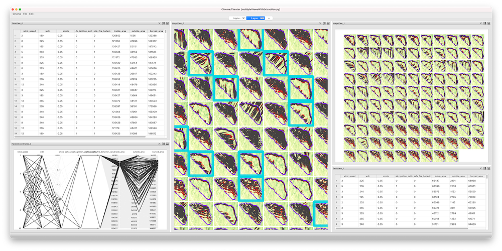

# Cinema FireView application

||
| ---- |
|*Screen capture of the FireView application.*|

FireView is an application created to explore the results of 

```
cinema FireView [path/to/database] "initial selection" "list of items selected across windows"
```

In the shell:

```
export PYCINEMA_SCRIPT_DIR=/directory/with/applications

cinema FireView [cinema database] "SELECT * from index LIMIT 100" "[id list of selection]"
```
